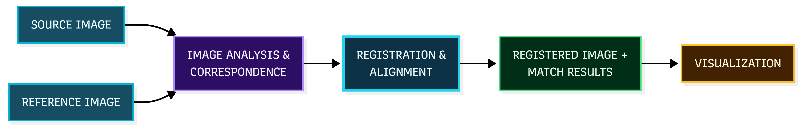
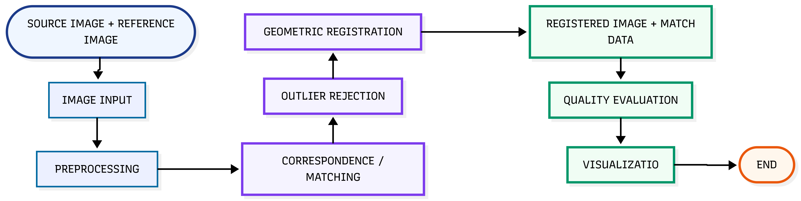

#  SELENE-REG

### Lunar Image Correspondence & Registration Platform


> **SIH26166 · Space Technology · Indian Space Research Organisation (ISRO)**

**SELENE-REG** is a full-stack prototype for **lunar image correspondence and registration**, designed around the SIH26166 problem statement involving Chandrayaan-2 imagery from **OHRC, TMC and IIRS**.

The platform brings image input, registration processing, correspondence analysis and result visualization together into a single software workflow.

---

##  From Lunar Images to Registered Results

Different lunar images of the same region may look significantly different because of:

-  Different illumination and Sun angles
-  Different viewpoints
- Different image scales and spatial resolutions
- Different imaging sensors and modalities
- Geometric differences across the observed terrain

SELENE-REG is designed to address these challenges through a structured image-registration workflow.



---

## Problem

Lunar image registration involves aligning images of the same region that may have been captured:

- at different times,
- from different viewpoints,
- under different illumination conditions,
- at different scales,
- or using different sensors.

These variations make direct image-to-image correspondence challenging.

For **SIH26166**, the target application focuses on correspondence and registration involving Chandrayaan-2 imaging modalities including:

- **OHRC — Orbiter High Resolution Camera**
- **TMC — Terrain Mapping Camera**
- **IIRS — Imaging Infrared Spectrometer**

The intended system should support registered image products, corresponding match points and quantitative evaluation of registration quality.

---

##  Our Approach

SELENE-REG follows a modular software workflow:

### 1. Input

The user provides the source and reference imagery through the web interface.

### 2. Processing

The backend receives the input through API endpoints and prepares it for the registration workflow.

### 3. Correspondence & Registration

The processing layer analyzes the source/reference relationship and performs the registration workflow.

### 4. Result Generation

Processed registration outputs and correspondence information are generated for further inspection.

### 5. Visualization

The web interface presents the workflow and generated results in an accessible form for analysis and demonstration.

---

##  Prototype

SELENE-REG is implemented as a **working full-stack prototype**, rather than only a static interface.

### Current Prototype Capabilities

| Component | Status |
|---|---|
| Web interface |  Implemented |
| FastAPI backend |  Implemented |
| API routing |  Implemented |
| Image/data upload workflow |  Implemented |
| Registration processing workflow | Implemented |
| Output handling |  Implemented |
| Frontend ↔ backend integration |  Implemented |
| Local end-to-end execution | Implemented |
| API health endpoint |  Implemented |
| Interactive API documentation |  Available through FastAPI |

---

##  System Architecture

The prototype follows a modular frontend–backend architecture connecting image input, API processing and result visualization.


> **The prototype connects lunar image input, correspondence analysis, registration processing and result visualization into a single software workflow.**

---

## Project Structure

```text
lunar-registration-suite/
│
├── backend/
│   ├── app/
│   │   └── routes/
│   │       └── registration/
│   │
│   ├── uploads/
│   ├── outputs/
│   └── requirements.txt
│
├── frontend/
│   ├── index.html
│   ├── css/
│   ├── js/
│   └── assets/
│
├── ARCHITECTURE.md
├── LICENSE-NOTE.txt
├── README.md
├── .gitignore
└── serve.py


---

## 1. Technology Stack

| Layer | Technologies |
|---|---|
| Frontend | HTML5, CSS3, JavaScript |
| Backend | Python, FastAPI, Uvicorn |
| Image Processing | OpenCV, NumPy |
| API | REST-style HTTP endpoints |
| Documentation | FastAPI / Swagger UI |
| Deployment | Local prototype / extensible for future deployment |

---

## 2. End-to-End Workflow
Geometric_Registration-2026-09-15-064347


#### 3. Evaluation
This is **important for SIH26166**, because it shows that you're thinking beyond simply displaying two images.

```markdown
##  Registration Evaluation

Registration quality can be evaluated using measurable correspondence and alignment metrics:

| Metric | Purpose |
|---|---|
| **RMSE** | Measures geometric registration error |
| **Inlier Match Count** | Measures the number of correspondences consistent with the estimated transformation |
| **Inlier Ratio** | Measures the proportion of reliable matches |
| **Spatial Match Distribution** | Evaluates whether correspondences cover the image rather than being concentrated in one region |

> **Note:** Final benchmark values and performance percentages will be reported after evaluation on the target SIH datasets.

---

##  Current Status

SELENE-REG is currently a **functional research-oriented prototype** demonstrating the complete software workflow from image input to backend processing and result visualization.

### Implemented

- [x] Web-based user interface
- [x] FastAPI backend
- [x] Frontend ↔ backend integration
- [x] Image input/upload workflow
- [x] Registration processing workflow
- [x] Output handling
- [x] Local end-to-end execution
- [x] API health endpoint
- [x] Interactive API documentation

### Next Development Stage

- [ ] Validation using target SIH datasets
- [ ] Quantitative benchmarking
- [ ] Improved illumination robustness
- [ ] Improved scale and viewpoint robustness
- [ ] Spatially distributed correspondence validation
- [ ] Performance optimization for larger image collections

---

##  Future Scope

The architecture can be extended toward:

- Advanced feature correspondence methods
- Multi-scale coarse-to-fine registration
- Robustness to extreme Sun-angle variations
- Cross-sensor and multi-modal correspondence
- Automated registration quality assessment
- GPU-accelerated processing
- Benchmarking across multiple lunar missions and datasets

---

## Quick Start

### Requirements

- Python 3.10+
- Git
- Modern web browser

### Windows

```cmd
git clone <YOUR-GITHUB-REPOSITORY-URL>
cd lunar-registration-suite

python -m venv venv
venv\Scripts\activate

pip install -r backend\requirements.txt

python serve.py

