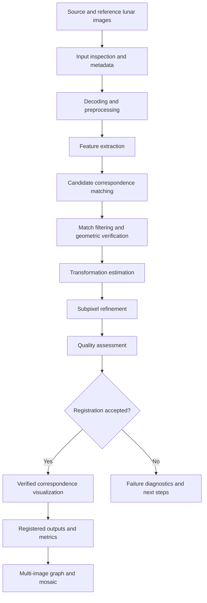
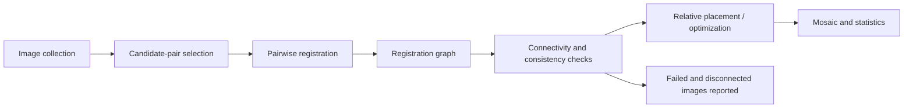
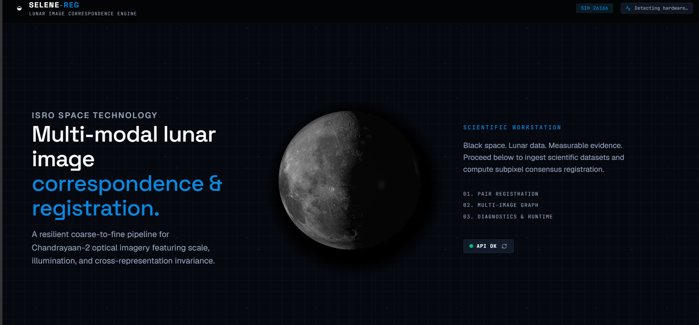
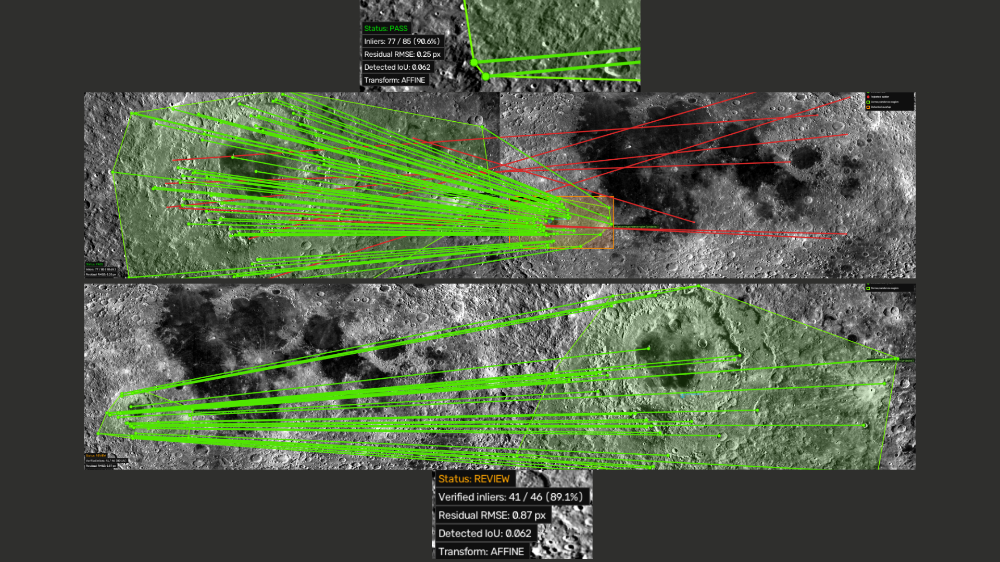
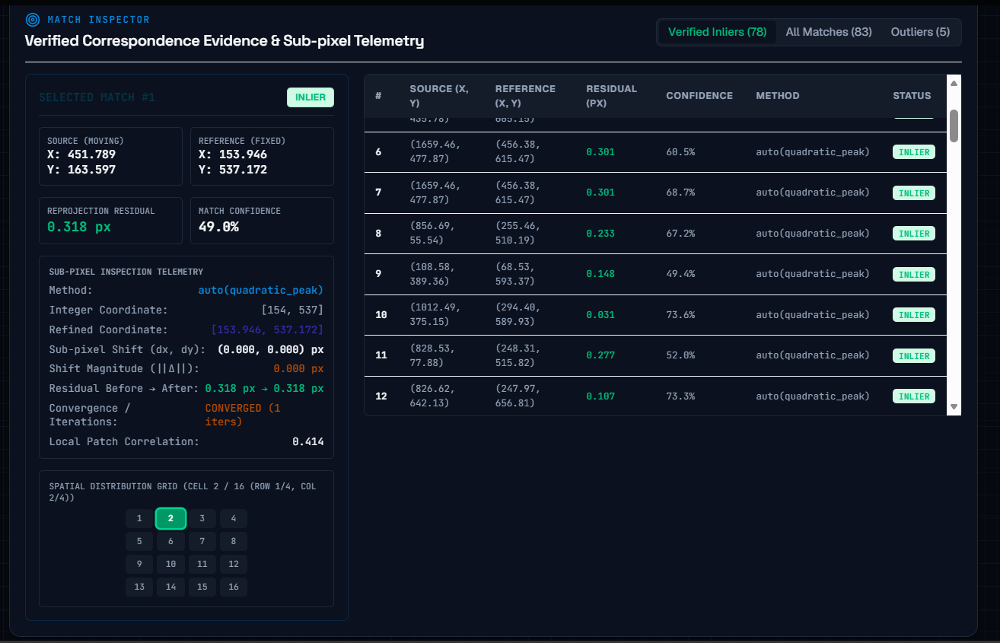
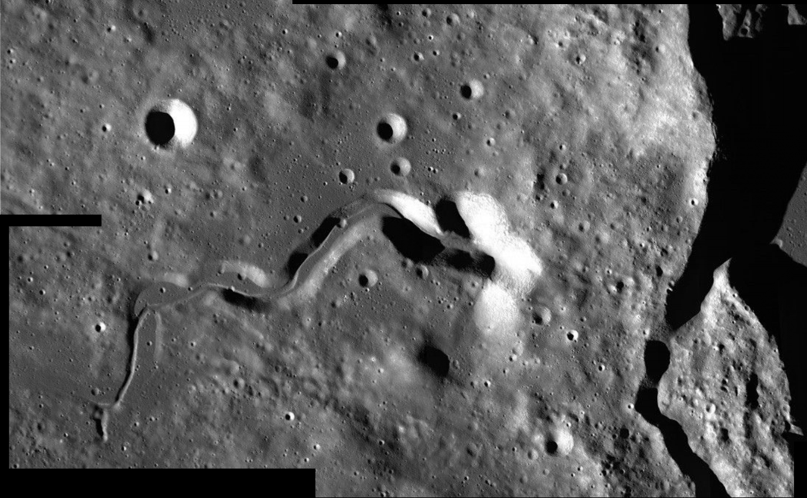

# SELENE-REG X

**Evidence-driven lunar image correspondence, geometric registration, and multi-image mapping.**
Team WAKA · Smart India Hackathon 2026 · Problem Statement SIH26166


> SELENE-REG X is a scientific prototype. This README distinguishes capabilities documented in earlier project audits from planned upgrades and areas where support has not been established. Performance figures and real-mission validation results are not claimed here.

---

## Contents

1. [Evidence legend](#evidence-legend)
2. [Overview](#overview)
3. [The scientific problem](#the-scientific-problem)
4. [Design principles](#design-principles)
5. [Registration pipeline](#registration-pipeline)
6. [Capability status matrix](#capability-status-matrix)
7. [Technical workflow in detail](#technical-workflow-in-detail)
8. [Multi-image registration and mosaics](#multi-image-registration-and-mosaics)
9. [Visualization](#visualization)
10. [Metrics and the quality gate](#metrics-and-the-quality-gate)
11. [Dataset scope and file formats](#dataset-scope-and-file-formats)
12. [CPU / GPU execution](#cpu--gpu-execution)
13. [Outputs and reproducibility](#outputs-and-reproducibility)
14. [Architecture and repository layout](#architecture-and-repository-layout)
15. [Getting started (unverified)](#getting-started-unverified)
16. [Intended user workflow](#intended-user-workflow)
17. [Testing and validation status](#testing-and-validation-status)
18. [Known limitations and historical issues](#known-limitations-and-historical-issues)
19. [Scientific integrity principles](#scientific-integrity-principles)
20. [Upgrade backlog](#upgrade-backlog)
21. [Screenshots](#screenshots)
22. [Verification checklist](#verification-checklist)
23. [Team, acknowledgements and licence](#team-acknowledgements-and-licence)

---

## Evidence legend

| Status | Meaning |
|---|---|
| **Documented** | Recorded as present in an earlier project audit. |
| **Planned** | Described in the engineering requirements or upgrade backlog. |
| **Unverified** | Support has not been established. |

---

## Overview

SELENE-REG X is a browser-based scientific workstation with a Python backend. It is designed to find corresponding surface features in lunar images captured under different conditions, estimate the geometric relationship between them, **measure whether the alignment is credible**, and extend pairwise results to multi-image alignment and visualization.

The central idea is that a screenful of match lines is not proof of a correct registration. SELENE-REG X is built around showing the evidence: which correspondences survived geometric verification, what transformation they imply, how well it fits, and when the system should say **FAIL**.

| | |
|---|---|
| **Domain** | Lunar remote sensing, scientific image registration, correspondence and geometric verification |
| **Target imagery** | Chandrayaan-2 OHRC, TMC/TMC-2, IIRS; reference imagery such as LRO NAC and SELENE/Kaguya where suitable data and formats are available |
| **Repository** | <https://github.com/tejasai-m-code/SELENE-REG-SIH26166> (`main`) |
| **Current maturity** | Prototype. Capabilities are tracked individually in the [status matrix](#capability-status-matrix). |

> The intended multi-mission scope does **not** establish that every instrument, product format or cross-modal combination has been validated.

---

## The scientific problem

Two observations of the same lunar surface can look very different. They may differ in:

- spatial resolution, ground sampling distance (GSD) and scale;
- rotation, viewing geometry and perspective;
- illumination direction, solar incidence angle and shadow geometry;
- contrast, noise, dynamic range and bit depth;
- sensor characteristics, spectral properties and processing level;
- image dimensions, footprint, overlap and metadata conventions.

Direct pixel-to-pixel comparison is unreliable under these differences. A usable system has to identify meaningful correspondences, reject false ones, estimate a plausible transformation, and judge whether the result is scientifically credible. A large number of descriptor matches is not, by itself, evidence of correct registration.

---

## Design principles

These are the design commitments that shape the project. Each one's implementation status is tracked in the [matrix](#capability-status-matrix), not asserted here.

1. **Evidence over appearance.** The primary pair-registration diagnostic is a canonical visualization showing the complete source and reference images with only geometrically verified correspondences. 
2. **Fit is not accuracy.** Model-fit RMSE, independent tie-point error, leave-one-out error, percentile errors and footprint overlap are kept as distinct quantities. 
3. **A failed gate is a valid result.** Quality-gate thresholds are never relaxed or statuses altered to produce a passing screenshot. Failures carry reasons. 
4. **Scientific data stays scientific.** Original pixel values are kept separate from display-normalized previews. 
5. **No invented metadata.** Sensor identity, GSD, illumination angles and coordinates are reported as *unavailable* when they cannot be established. 
6. **Truthful hardware reporting.** GPU detection is not proof that a job ran on the GPU; the actual execution path is reported. 
7. **Relative is not absolute.** Image-space alignment and mosaics are not georeferencing. (terminology documented in the earlier audit)

---

## Registration pipeline

The diagram shows the **planned system-level workflow**. Stage names, branching and algorithms must be reconciled with the current source ().


```mermaid
flowchart TD
A[Source and reference lunar images] --> B[Input inspection and metadata]
B --> C[Decoding and preprocessing]
C --> D[Feature extraction]
D --> E[Candidate correspondence matching]
E --> F[Match filtering and geometric verification]
F --> G[Transformation estimation]
G --> H[Subpixel refinement]
H --> I[Quality assessment]
I --> J{Registration accepted?}
J -- Yes --> K[Verified correspondence visualization]
K --> L[Registered outputs and metrics]
L --> M[Multi-image graph and mosaic]
J -- No --> N[Failure diagnostics and next steps]
```

**Multi-image extension (intended):**


```mermaid
flowchart LR
I[Image collection] --> S[Candidate-pair selection]
S --> P[Pairwise registration]
P --> G[Registration graph]
G --> C[Connectivity and consistency checks]
C --> O[Relative placement / optimization]
O --> M[Mosaic and statistics]
C --> X[Failed and disconnected images reported]
```

---

## Capability status matrix

"Documented" means recorded in an earlier audit of the codebase. **No row below is confirmed against the current build.**

### Core pair registration

| Capability | Status | Notes |
|---|---|---|
| Source/reference pair input | Documented | Earlier audit describes pairwise registration |
| SIFT, ORB, AKAZE feature options | Documented | Availability of each (notably AKAZE) depends on environment and library support |
| KNN descriptor matching + ratio-test filtering | Documented | |
| Homography via `cv2.findHomography` with RANSAC | Documented | |
| ECC refinement via `cv2.findTransformECC` | Documented | Running a refinement does not by itself prove sub-pixel accuracy |
| Mutual-match filtering, spatial-distribution checks | Planned | Listed in requirements; implementation |
| Affine / polynomial / thin-plate-spline / local models | Planned | Not interchangeable with homography; implemented set |
| MAGSAC or alternative robust estimator | Planned | |
| Taylor / Lucas–Kanade, phase correlation, quadratic peak refinement | Planned | Present in backlog; availability |
| Learned matching (e.g. LoFTR) | Unverified | A checkpoint (`models/loftr_outdoor.ckpt`, ~44.2 MB) existed at an earlier local inspection. A checkpoint alone does not show the dependencies, loading path and inference are operational. |
| Evidence-based AUTO radiometric selection | Planned | Must evaluate measured candidates, not use a fixed rule |

### Preprocessing and radiometry

| Representation | Status |
|---|---|
| Raw DN | Planned / implementation |
| Percentile stretch | Planned / |
| CLAHE | Planned / |
| Gradient, high-pass | Planned / |
| Retinex, phase congruency, structural representations | Planned / |
| Illumination / physics-informed normalization | Planned / |
| Common GSD / scale normalization | Planned / |

### Multi-image, visualization and reporting

| Capability | Status | Notes |
|---|---|---|
| Multi-image graph-map-builder workflow | Documented | Earlier audited version limited to **12 images** |
| Pairwise registration graph module | Documented | |
| Relative mosaic with feathered overlap | Documented | Relative image space only |
| Graph, metrics and report exports; caching architecture | Documented | Actual filenames/formats |
| Controlled synthetic stress test (scaled/rotated variants) | Documented | Synthetic only; see [validation](#testing-and-validation-status) |
| WebGL2 3D viewer (intensity-derived relief) | Documented | Visualization only; **not** a measured DEM |
| Scientific canonical match visualization as primary view | Planned | Current UI behaviour |
| Match Inspector, per-match records, uncertainty | Planned | Uncertainty only where a method supports it |
| LOOCV and independent validation | Planned | |
| Scalable batches (50 / 100 / 200 images) | Planned | **Not tested; do not claim** |
| Dataset-folder ingestion and manifest | Planned | |
| PDS3/PDS4 and scientific metadata ingestion | Planned | Reader coverage |
| CPU / GPU / hybrid telemetry | Planned | Real GPU use unproven |
| Scientific output package, QA report, config replay | Planned | |

---

## Technical workflow in detail

### 1. Input inspection

The system is meant to inspect each input for width, height, channel/band count, data type, bit depth, encoding, associated metadata, and likely sensor or product type *when evidence exists*. Missing metadata is reported as unavailable, never guessed. 

### 2. Preprocessing and radiometric representations

Preprocessing aims to expose real surface structure under differing contrast and illumination. Candidate representations are listed in the [matrix](#preprocessing-and-radiometry). Two rules apply: original scientific values are not overwritten by enhanced previews, and any AUTO mode must pick a representation from measured diagnostics and record why. 

### 3. Feature extraction and matching

The earlier audit documents SIFT, ORB and AKAZE detectors with KNN matching and ratio-test filtering. 

| Method | Intended role |
|---|---|
| SIFT | Distinctive local features tolerant of some scale and rotation change |
| ORB | Lower-cost feature and descriptor option |
| AKAZE | Additional local detector/descriptor, subject to library support |
| Ratio test | Reject ambiguous nearest/second-nearest candidates |

For each run the intended record includes detector/matcher, keypoint and descriptor counts, candidate and ratio-test matches, geometric inliers, inlier ratio, runtime and failure reasons. A candidate match is not a valid correspondence until it survives verification.

### 4. Geometric verification and model selection

The earlier audit documents RANSAC homography estimation. The requirements go further: choose among translation, similarity, affine, homography, polynomial, TPS or local models according to the physical image relationship, correspondence distribution, stability, residuals and independent prediction error — not by lowest training residual, and not by forcing a homography on every pair. 

A homography models a projective mapping between image planes. It does not establish georeferencing or a three-dimensional lunar surface solution.

### 5. Sub-pixel refinement

ECC refinement is documented. The backlog adds Taylor-style refinement, Lucas–Kanade, phase correlation with upsampling and local peak fitting. For any refinement, the intended record is: requested, attempted, converged, before/after error where measurable, measured improvement and failure reason. Sub-pixel improvement is claimed only where computed evidence supports it.

---

## Multi-image registration and mosaics

The multi-image workflow is more than registering every image independently:

1. Discover or select input images.
2. Identify candidate pairs likely to overlap or share features.
3. Estimate pairwise correspondences and transformations.
4. Represent relationships as a graph.
5. Check connectivity and transformation consistency.
6. Optimize relative positions *where implemented*.
7. Generate a mosaic and report statistics.

**Documented (earlier audit):** graph-map-builder workflow, pairwise registration, a registration-graph module, relative mosaic generation with feathered overlap, graph/metrics/report exports, and a caching architecture, in a version limited to 12 images. 

**Planned:** scalable candidate-pair screening instead of exhaustively registering every pair (200 images would otherwise mean 19,900 full-resolution pair registrations); lazy loading, pyramids, bounded workers and descriptor caching; connected-component analysis; cycle consistency; explicit reporting of failed and disconnected images; and valid-pixel masks so blank canvas is never presented as lunar data. 

> **Terminology.** Relative image-space registration is not absolute lunar georeferencing. A visually continuous mosaic does not prove geographic accuracy.

---

## Visualization

**Scientific canonical match visualization (intended primary view).** 

- Complete source and complete reference image side by side.
- Lines only between **verified** correspondences, with consistent image coordinates.
- Rejected/outlier lines excluded from the default view (rejection diagnostics available elsewhere).
- Zoom/pan, hover/click point inspection, coordinate readout, and residual/confidence/sub-pixel/uncertainty values **only where actually computed**.
- The downloadable image and the in-app view must come from the same underlying results.

An earlier interface drew green and red match lines; the requirement is verified inliers in the primary view only.

**Registered view.** A cropped overlap or poorly framed warped image can be misleading as the sole proof of success, so it is a separate product from the correspondence evidence. 

**3D viewer.** The earlier audit documents a WebGL2 viewer that extrudes terrain-like relief from image intensity. It is an *intensity-derived visualization*, not a digital elevation model.

---

## Metrics and the quality gate

| Quantity | Meaning | Status |
|---|---|---|
| Inlier count / ratio | Correspondences accepted by geometric verification | discussed in audit |
| Reprojection RMSE | Fit of the estimated model to its own correspondences (**model-fit**, not independent accuracy) | discussed |
| Spatial distribution / coverage / uniformity | How evenly verified points cover the image | discussed; computation details |
| Footprint IoU | Overlap of transformed footprints | |
| Transformation stability and plausibility | e.g. determinant, condition number, corner displacement | |
| Independent tie-point error, LOOCV RMSE, median, 95th-percentile, max | Prediction error not used to fit the model | |
| Runtime and resource use | Measured, not assumed | |

A quality gate is intended to return **PASS, WARN or FAIL** with a reason. Where independent ground truth is unavailable, the limitation is stated rather than substituted with fit error.

---

## Dataset scope and file formats

| Source | Role | Support status |
|---|---|---|
| Chandrayaan-2 OHRC | Target imagery | Not established on real products |
| Chandrayaan-2 TMC / TMC-2 | Target imagery | |
| Chandrayaan-2 IIRS | Target imagery | |
| LRO NAC | Reference imagery | |
| SELENE / Kaguya | Reference imagery | |

Ordinary raster formats (PNG, JPEG, TIFF, GeoTIFF, BMP) are distinct from mission scientific products. A `.img` file may need a product-specific reader, an accompanying label and interpretation of the stored sample format. PNG/JPEG are treated as display or demonstration inputs unless provenance shows otherwise, because they may not preserve original radiometry.

Intended handling: standard formats, scientific rasters, PDS-style products and labels, metadata-aware interpretation, dataset-folder manifests, and **explicit reporting of unsupported files**. Current parser coverage, calibration handling and real-mission-data results are unverified. Do not read this table as support for any specific OHRC, TMC, IIRS, PDS4 or LRO NAC product.

---

## CPU / GPU execution

CPU fallback, GPU execution where supported, and optional hybrid scheduling are engineering goals. The requirement is that each job reports its *actual* execution mode (CPU, GPU or HYBRID), records fallbacks and failures, and uses bounded batches and memory-aware scheduling. No speed-up is claimed; performance statements require reproducible measurements. Detected hardware has varied across project notes and must be confirmed on the demonstration machine .

---

## Outputs and reproducibility

**Documented:** graph, metrics and report exports; caching; analytics. Filenames and formats .

**Intended scientific package** (only artifacts genuinely generated in a run): 

```text
SELENE-REG-X_Registration/
├── registered.tif
├── mosaic.tif
├── tiepoints.csv
├── tiepoints.geojson
├── transform.json
├── metrics.json
├── sensor_metadata.json
├── illumination_metadata.json
├── processing_config.json
├── correspondence_visualization.png
└── QA_report.html
```

`processing_config.json` is intended to capture the radiometric mode, detector/matcher, geometric model, sub-pixel method, execution preference and thresholds, and support configuration replay where technically possible, with nondeterministic or unavailable components documented. No field may imply a measurement that was not made.

---

## Architecture and repository layout

**Client–server.** A browser frontend (HTML/CSS/JavaScript in the earlier audit) talks to a FastAPI backend that runs Python scientific processing. The frontend's intended responsibilities are image selection, detector/threshold configuration, status and metrics, match visualization, multi-image graph inspection, mosaic/output inspection, diagnostics and exports.

**Layout recorded in an earlier audit** (historical — may not match the current tree ):

```text
SELENE-REG-X/
├── frontend/
│ ├── index.html
│ ├── app.js
│ └── styles.css
├── backend/
│ ├── main.py
│ ├── requirements.txt
│ └── app/
│ ├── services/
│ │ ├── preprocessing.py
│ │ ├── feature_matching.py
│ │ ├── registration.py
│ │ ├── pairwise_registration.py
│ │ ├── multi_registration.py
│ │ ├── registration_graph.py
│ │ ├── mosaic.py
│ │ └── evaluation.py
│ └── utils/
│ └── image_utils.py
├── tests/
└── images/
```

> Later project notes also mention `artifacts/`, `models/`, `tests/fixtures/`, `lib/`, `package.json`, `tsconfig*.json`, and `uv.lock`, which may reflect an evolved repository layout.

**Technology.**

| Technology | Role | Status |
|---|---|---|
| Python | Backend and scientific processing | |
| FastAPI | Backend API | |
| OpenCV | Feature extraction, geometric estimation, warping | |
| NumPy | Array processing | |
| SciPy | Numerical processing where used | (extent ) |
| HTML / CSS / JavaScript | Earlier frontend stack | (current stack ) |
| WebGL2 | 3D viewer | |
| PyTorch | In the technical plan for learned matching | Integration unverified |
| Jupyter / Colab | Experimentation and validation tooling | Not necessarily runtime dependencies |

A library in a plan or dependency file is not evidence that the corresponding feature is active.

---

## Getting started (unverified)

> **Setup note:** confirm the commands, paths, ports, and versions for your local checkout before following these instructions.

```bash
git clone https://github.com/tejasai-m-code/SELENE-REG-SIH26166.git
cd SELENE-REG-SIH26166
```

Known historical information (do not treat as instructions):

- An earlier audit recorded a backend launch resembling `uvicorn backend.main:app`. Current launch scripts must be checked.
- A dependency list was recorded at `backend/requirements.txt` in the earlier layout; a package/tooling setup (`package.json`, `uv.lock`) is mentioned in later notes. Installation steps depend on which applies.
- One development session used a launcher reporting a backend on `localhost:5000` and a frontend on `localhost:5173`. These describe that session only.
- Development has occurred on Windows; the checkout path has varied between environments.
- Optional learned-matching dependencies and model weights may be unavailable in some environments.

**To complete this section:** record the Python version, OS, exact install commands from a clean environment, how the frontend and backend are started, ports, environment variables, and the result of loading the application and running one pair.

---

## Intended user workflow

The journey the system is designed to support (each step to be confirmed in the current UI ):

1. Open SELENE-REG X and load images or a dataset folder.
2. Inspect the manifest and metadata.
3. Select source and reference images.
4. Select or evaluate preprocessing.
5. Run feature extraction and matching.
6. Perform robust geometric verification.
7. Inspect verified correspondences on complete images.
8. Inspect transformation and registration metrics.
9. Run and evaluate sub-pixel refinement where available.
10. Review the quality gate and its explanation.
11. Run multi-image registration.
12. Inspect the graph and any failed/disconnected images.
13. Generate a mosaic where supported.
14. Review validation and scientific QA.
15. Export the scientific package and configuration.

---

## Testing and validation status

> Testing should be reported by category. Synthetic validation, real-mission imagery tests, independent ground-truth validation, and performance benchmarks are separate forms of evidence.

The earlier audit mentions `tests/test_api_contract.py` and `tests/test_master_quality.py`, and a controlled synthetic stress test. Later notes list many further modules (dataset scanning, global optimization, hardware manager, mosaic geometry, registration quality and geometry, scalability, scientific output consistency, URL ingestion, phase tests and frontend-hook tests). Their current existence, coverage and results are unverified.

Different kinds of validation establish different things and must be reported separately:

| Category | What it establishes | Status |
|---|---|---|
| Unit tests | Behaviour of individual functions | not recorded |
| API contract tests | Expected inputs, outputs, errors | not recorded |
| Synthetic validation | Behaviour on generated/transformed imagery | no results recorded here |
| Manual UI testing | Observed frontend behaviour | |
| Real lunar imagery testing | Results on authentic mission data | **not established** |
| Independent ground-truth validation | Accuracy against trusted references | **not established** |
| Performance benchmarking | Time and resources under stated conditions | none |

Synthetic results, when added, must be labelled synthetic and never presented as cross-mission accuracy.

---

## Known limitations and historical issues

These are documented concerns and requirements, **not** a list of defects confirmed in the current build:

- **Visual-vs-gate mismatch.** An earlier case showed convincing match lines but a failed quality gate, with differing raw and final RMSE, very low footprint IoU, a large affine translation, and a registered preview showing the image as a tiny object on a large canvas. The investigation targets transform direction, forward/inverse mapping, resize factors, coordinate origins, width/height ordering and footprint construction. The earlier values are historical diagnostics, not benchmarks, and this README does **not** state the issue was resolved.
- Optional libraries or algorithms were unavailable in some environments.
- Real-mission-data validation is not established.
- Real GPU use versus CPU fallback must be demonstrated by measurement.
- Every UI control must be confirmed to invoke a real operation.
- Unsupported file formats and missing metadata must be reported explicitly.
- Earlier multi-image audit limit: 12 images. Larger-scale behaviour is untested.
- Image-space alignment is not georeferencing; the 3D view is not a DEM.
- Provenance, reproducibility and failure diagnostics were identified as needing strengthening.

---

## Scientific integrity principles

1. **No fabricated results** — no invented correspondences, confidence, inlier ratios, RMSE, sensor identity, metadata or accuracy.
2. **No cosmetic success** — a failed registration is never relabelled PASS for a screenshot.
3. **Evidence-based automatic choices** — AUTO modes evaluate real evidence.
4. **Preserve scientific data** — originals stay separate from display enhancements.
5. **Truthful hardware reporting** — detection ≠ use.
6. **Transparent failures** — rejections explain why and suggest legitimate next steps.
7. **Reproducibility** — record configuration and processing provenance.
8. **No unsupported superiority claims** — no claim to outperform established tools without comparative evidence.
9. **Relative vs absolute geometry** — keep them distinct.
10. **Document the real implementation** — features seen only in plans or comments are not working features.

---

## Upgrade backlog

The 28-item scientific upgrade backlog describes planned engineering work; it is not a record of completed features.

<details>
<summary>Show all 28 items</summary>

| # | Item | Priority |
|---|---|---|
| 1 | Scientific output package | High |
| 2 | Per-match scientific records | High |
| 3 | Uncertainty and covariance estimation (only where supported) | High |
| 4 | Separate model-fit error from actual accuracy | High |
| 5 | LOOCV validation for flexible transforms | High |
| 6 | Uniformity engine (grid occupancy, coverage, empty cells) | High |
| 7 | Match-point reseeding of weak regions | High |
| 8 | Common GSD / scale normalization | High |
| 9 | DEM-assisted orthorectification (only with suitable DEM and geometry) | High |
| 10 | Sensor and illumination metadata (measured vs derived vs inferred vs unavailable) | High |
| 11 | Evidence-based AUTO radiometric selection | High |
| 12 | Multi-track correspondence agreement | High |
| 13 | Controlled ground-truth benchmark | High |
| 14 | PDS3/PDS4 and scientific metadata ingestion | High |
| 15 | Truthful CPU/GPU/HYBRID telemetry | High |
| 16 | Processing provenance | High |
| 17 | Scientific QA report | High |
| 18 | Phase congruency and structural representations | Medium |
| 19 | IIRS-specific processing | Medium |
| 20 | Sensor-aware reference selection | Medium |
| 21 | Optional learned-matching track | Medium |
| 22 | Advanced geometric model selection | Medium |
| 23 | Baseline comparison engine | Medium |
| 24 | Transformation / reprojection diagnostics | Medium |
| 25 | Scientific canonical match visualization | Medium |
| 26 | Validation & Scientific QA on the actual session | Medium |
| 27 | Scientific audit page | Medium |
| 28 | Reproducible configuration replay | Medium |

Further scalability goals: recursive dataset ingestion with a manifest, removal of artificial image-count limits, scalable candidate-pair screening, and GPU memory safety — all untested targets.

</details>

---

## Screenshots

The following screenshots are stored in `docs/assets/` and show the SELENE-REG X prototype.



*Main SELENE-REG X workstation interface.*



*Source and reference imagery with visualized correspondences.*



*Registration metrics and quality-gate interface.*



*Lunar image mosaic output.*

---

## Team, acknowledgements and licence

**Team WAKA** — Smart India Hackathon 2026, Problem Statement SIH26166.
<!-- Add team member names and roles if desired. -->

**Acknowledgements (to confirm).** Chandrayaan-2 instrument teams and data portals; NASA LRO/LROC; JAXA SELENE/Kaguya; and the open-source projects the system builds on (OpenCV, NumPy, SciPy, FastAPI). Confirm the exact data sources and attributions used.

**Mission data.** Do not redistribute mission imagery in this repository without confirming the provider's data policy .

**Licence.** Not confirmed in the supplied material. Add a licence file and update this section.
